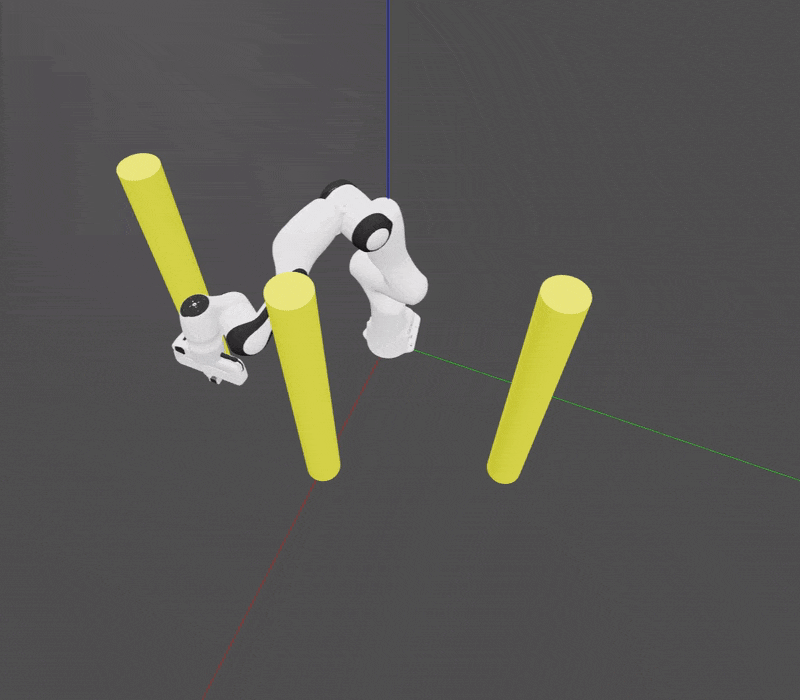

# DiffCo: Auto-Differentiable Proxy Collision Checking

## Updates
<!-- <span style="color:red"> [*NEW*]</span>  -->
🟥 *[05/30/2023]* **First notebook tutorial** available! Check out [`trajectory_optimization_tutorial.ipynb`](notebook_tutorials/trajectory_optimization_tutorial.ipynb)
(A few upgrades to optimization setup as well.)

This is the codebase for our paper **DiffCo: Auto-Differentiable Proxy Collision Detection with Multi-class Labels for Safety-Aware Trajectory Optimization**, Yuheng Zhi, Nikhil Das, Michael Yip. [[arxiv]](https://arxiv.org/abs/2102.07413)[[IEEE T-Ro]](https://ieeexplore.ieee.org/document/9747928)

RRT-Connect             |  Optimized
:-------------------------:|:-------------------------:
 | 

## Installation
It is recommended to use [Conda](https://docs.conda.io/projects/conda/en/latest/user-guide/getting-started.html) for virtual environment management.
```
pip install -r requirements.txt
pip install -e .
```
### Additional steps for Moveit experiments
1. Install [MoveIt](https://moveit.ros.org/install/).
2. To install Baxter configurations, refer to [this tutorial](https://github.com/RethinkRobotics/sdk-docs/wiki/MoveIt-Tutorial) but change the versions of ros according to the one you installed. Note: Ubuntu 20.04 only has ros noetic supported AFAIK, so please do modify command lines from the Baxter tutorial according to the ros version that you installed.

## Start using DiffCo:
**The best entry point is the notebook tutorial under `notebook_tutorials/`.** (More to come)

This is a library of a relatively easy implementation of the differentiable collision checker itself (under the directory `diffco`) and some scripts to reproduce experiments in the paper (under the directory `script`)
1. `speed_compare.py` includes comprehensive examples of using DiffCo to do trajectory optimization. Besides the experiment in the paper, we also included an implementation of using DiffCo with Adam to optimize trajectories under constraints. 
2. `motion_planner.py` shows how we use OMPL (as initial point for optimization).
3. `[2,3]d_data_generation.py` implements how to use MoveIt and FCL to generate the initial dataset for Baxter and Plannar robots, respectively. You may use any of your favourite collision detection library to do this. In the tutorial, we also tried [roboticstoolbox-python](https://github.com/petercorke/robotics-toolbox-python).
4. `active.py` contains code of the active learning experiment.
5. `test_correlation.py` contains code to evaluate the correlation between DiffCo output and FCL.
6. `escape.py` and `compare_sampling.py` contain code to do the free-space sampling speed comparison.
7. `diffco/optim.py` now contains our code for trajectory optimization. The code in `scirpts/trajectory_optimization.py` are going to be deprecated.
8. `diffco/routines.py` contains a few convenient subroutines that appear often enough that we decided to write them into functions.

For more info on how to get started with these scripts (to, e.g., reproduce our experiments), see [`experiments.md`](experiments.md).


