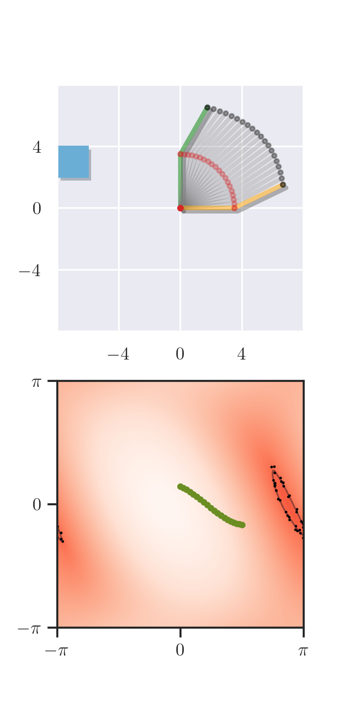
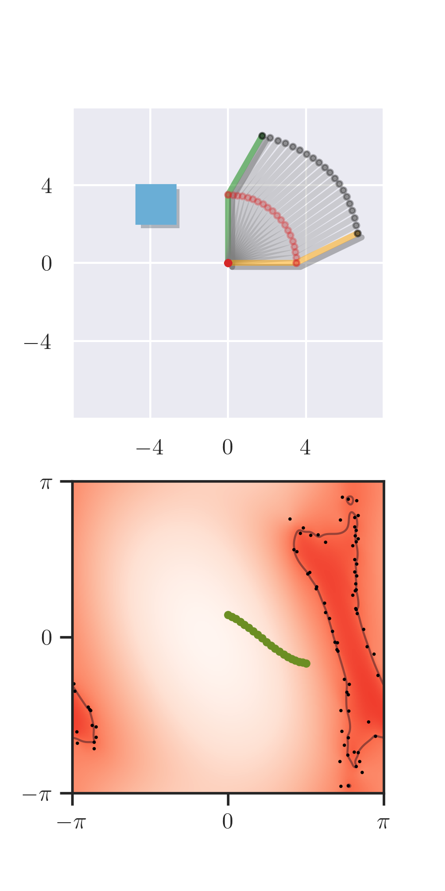
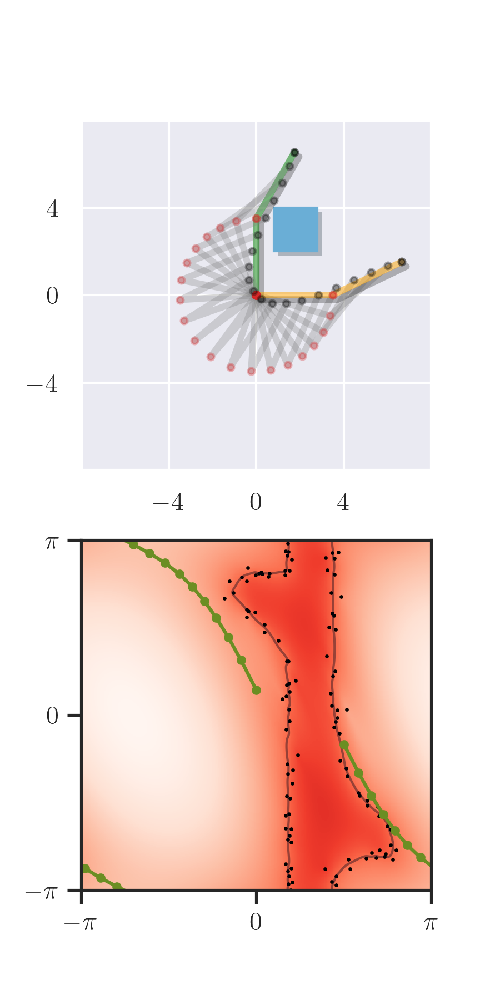
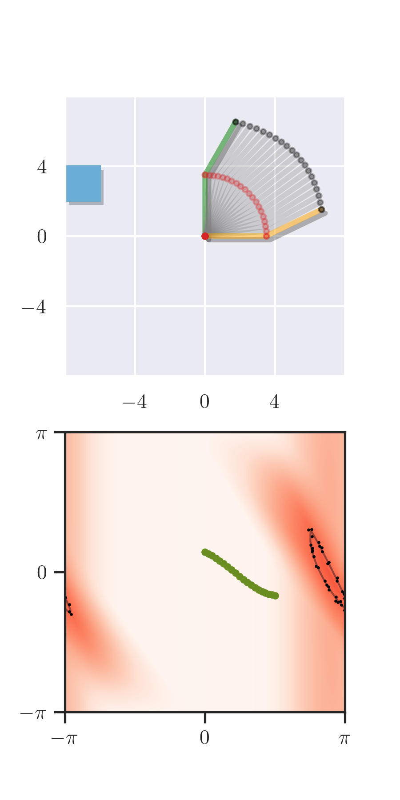
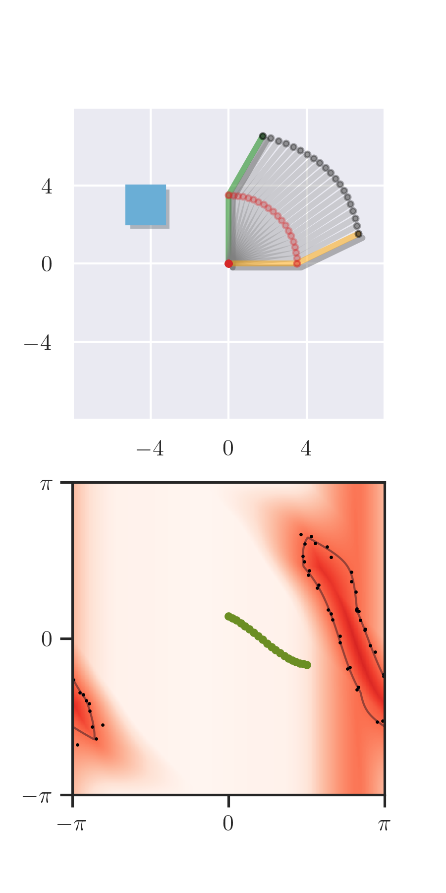
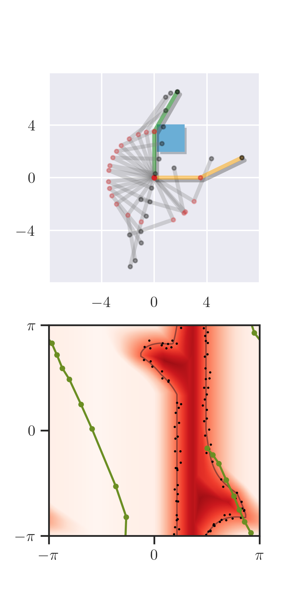

# Instructions for Reproducing Experiments from the Paper

Table of Contents:
- [Instructions for Reproducing Experiments from the Paper](#instructions-for-reproducing-experiments-from-the-paper)
  - [Experiment A: Evaluation of DiffCo Score](#experiment-a-evaluation-of-diffco-score)
    - [2D environment](#2d-environment)
    - [3D environment](#3d-environment)
  - [Experiment C: Trajectory Optimization that Avoids Important Objects](#experiment-c-trajectory-optimization-that-avoids-important-objects)
    - [2D environment](#2d-environment-1)
    - [3D environment](#3d-environment-1)
  - [Experiment D: Trajectory Optimization with Dynamic Objects](#experiment-d-trajectory-optimization-with-dynamic-objects)
    - [2D environment](#2d-environment-2)
    - [3D environment](#3d-environment-2)

---

## Experiment A: Evaluation of DiffCo Score

### 2D environment
Use the script `scripts/test_correlation.py` to generate correlation and FCL comparison figures. If you do not provide a dataset, a default one will be autogenerated for you.
```
python scripts/test_correlation.py correlate
```
<div>
    
    
</div>

```
python scripts/test_correlation.py compare
```


To create a dataset, use the script `2d_data_generation.py` to create data for a handful of predefined environments. Use the `--help` flag to see all the possible environments.
```
python scripts/2d_data_generation.py --help`
```

```
python scripts/2d_data_generation.py --env 3d_halfnarrow --dof 7 --link-length 1
```


```
python scripts/2d_data_generation.py --env 1rect_1circle --dof 3 --link-length 2
```


Once you have the dataset you want, pass it in to the `scripts/test_correlation.py` script with the `--dataset` flag.


### 3D environment
Documentation coming soon.

---

## Experiment C: Trajectory Optimization that Avoids Important Objects
### 2D environment
Use the script `2d_trajopt.py` to generate trajectory optimization plans and figures. If you do not provide a dataset, a default one will be autogenerated for you.
```
python scripts/2d_trajopt.py
```


You can also specify custom start and target configurations.
```
python scripts/2d_trajopt.py --start-cfg 1 0.5 0 --target-cfg -1 -0.5 0
```


Using the `--safety-margin` flag, you can assign a bias to one of the classes.
```
python scripts/2d_trajopt.py --start-cfg 1 0.5 0 --target-cfg -1 -0.5 0 --safety-margin -12 -1.2
```


You can pass in a custom dataset with the `--dataset` flag.
```
python scripts/2d_data_generation.py --env 2class_2 --dof 7 --label-type class --link-length 1
python scripts/2d_trajopt.py -d data/landscape/2d_7dof_2obs_class_2class_2.pt --start-cfg 3.14 0 0 0 0 0 0 --target-cfg 0 0 0 0 0 0 0
```


The script also generates a video animation.


### 3D environment
Documentation coming soon.

---

## Experiment D: Trajectory Optimization with Dynamic Objects
### 2D environment
Use the script `active.py` to generate trajectories and figures for snapshots of environments with moving obstacles. If a dataset is not provided, one will be autogenerated. You can generate trajectories using either DiffCo or FCL.

```
python scripts/active.py diffco
```
<div>
    
    
    
</div>

```
python scripts/active.py fcl
```
<div>
    
    
    
</div>

### 3D environment
Documentation coming soon.

---
